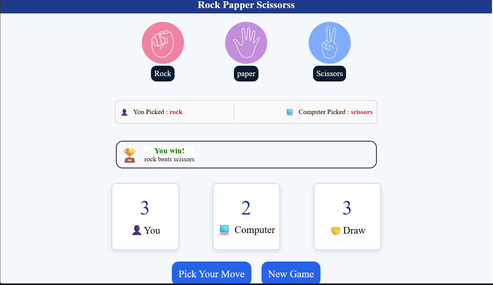

# 🎮 Stone Paper Scissors Game

A simple and interactive **Stone Paper Scissors** game built using **HTML, CSS, and JavaScript**. Challenge the computer, keep track of scores, and enjoy a clean and responsive user interface.

---

## 📸 Project Preview



---

## ✨ Features

- 🎮 Play against the computer
- 📊 Live score tracking
- 🟢 Win, 🔴 Lose & 🟡 Draw result messages
- 🔄 New Game button
- 🎨 Clean and responsive UI
- ⚡ Smooth gameplay using JavaScript

---

## 🛠️ Technologies Used

- HTML5
- CSS3
- JavaScript (DOM Manipulation)

---

## 📂 Project Structure

```text
Stone-Paper-Scissors/
│── index.html
│── style.css
│── script.js
│── screenshot.png
│── images/
│   ├── rock.png
│   ├── paper.png
│   └── scissors.png
```

---

## 🚀 How to Run

1. Clone this repository.
2. Open the project folder.
3. Open `index.html` in your browser.
4. Start playing!

---

## 📚 What I Learned

- DOM Manipulation
- Event Handling
- Conditional Logic
- JavaScript Functions
- CSS Flexbox
- Responsive UI Design

---

## 👨‍💻 Author

**Yash Raghuwanshi**

🌐 https://yraghuwanshi124-art.github.io/stone-paper-scissors/

---

⭐ If you like this project, don't forget to **Star** this repository!
